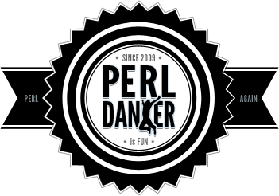

# Dancer2
### a micro web framework



Russell (veryrusty) Jenkins

Dancer2 core developer

---
# Dancer

### Background

* Initially a true port of Sinatra (ruby)
*  Much loved and extended
* But.. Uses globals
* Effectively restricting you to one dancer app per server.

---
# Dancer 2

### Complete rewrite

* Modern perl 
  * Moo
* No globals (ok, one remains)
* Many apps at once
* No issues with using dependencies from CPAN
  * But must be fat-packable.

---
# Dancer 2

### Focus on PSGI infrastructure

> One does not build applications in Dancer2;
>   instead you build (PSGI) applications 
>   using Dancer2 as part of your toolset.

---
# What's new

### in v0.150_000

* Lots of small bug fixes and doc patches 
  * 15 contributors
* Merge routes from several namespaces (subclasses) into a single app
* Improved multi-app support
  * separate configuration
  * independent dispatchers.
* Removed memory leaks

---
## Route Merging

```perl
package OurApp
use Dancer2; # Default appname is the packages name

get '/' => sub {'Hello'};
...
```

```perl
package OurApp::Admin
use Dancer2 appname => 'OurApp';
prefix => '/admin';

get '/' => sub {'world'};
...
```

```perl
# app.psgi
use OurApp;
use OurApp::Admin;

OurApp->psgi_app;
```


---
## Multi-app improvements

* Each app can have its own configuration
  * but; config location guessing is still fugly
* Dispatch over a subset of all registered apps

```perl
# appnames
Dancer2->psgi_app('MyApp', 'MyWiki');

# regex
Dancer2->psgi_app(qr/^My/);

# app coderefs
Dancer2->psgi_app($app1, $app2, $app3);
```


---
## Removing memory leaks

  * Removal of context object 
    * app <-> context
      * wasn't always cleared at end of request cycle
  * Test::Memory::Cycle
    * Handler classes use `weak_ref => 1`
    * After hook - closure over a weakened copy of app
      - an approach similar to `curry::weak`

---
## Whats not so great

Removal of Context object may require code changes

* Added some compatibility shims; but..
  * `$app->session` in now a read only accessor
    -  use `$dsl->session()` for old behaviour. 
  * Broke some (external) engine subclasses that need access to the request or PSGI env
    * eg. Dancer2::Session::PSGI

---
## Whats next ?

* More focus on apps as "first class" citizens
  * `pass` and `forward` to only work for a single app
    * more deterministic routing
    * Removes nasty edge cases with session management between apps
* More flexible responses - in line with PSGI spec
  * body may be a Handle
  * streaming / delayed response
* Rework plugin support
  * current technique has limitations
  
---
## Where can I get it ?

* `cpanm Dancer2`
* website:  http://perldancer.org/
* github: https://github.com/PerlDancer/Dancer2 
